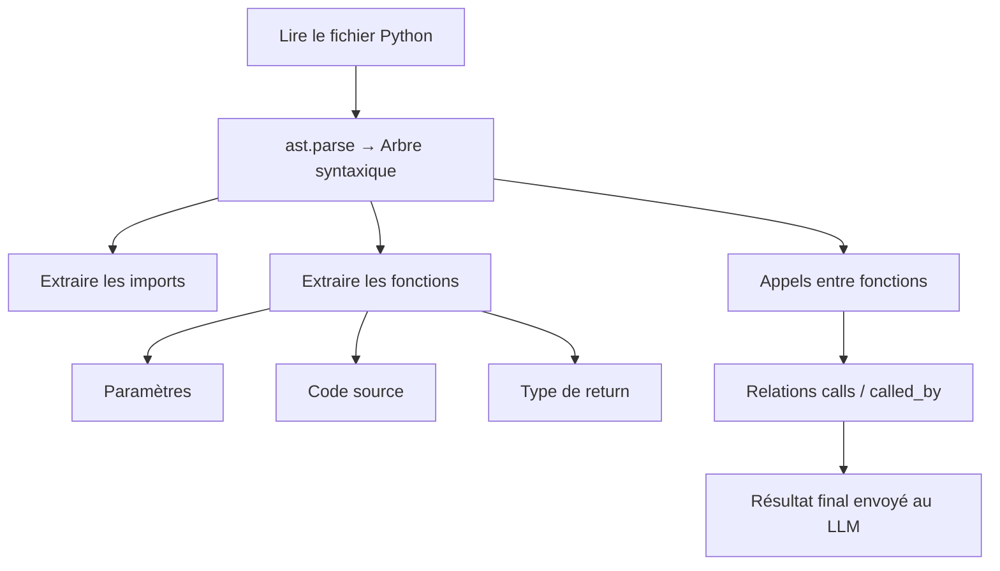

# Analyse statique avec `ast` dans Gentleman-LLM

Gentleman-LLM utilise le module Python **`ast`** pour analyser automatiquement le contenu d’un fichier Python.  L’objectif est d’extraire des informations structurées pour guider la LLM dans l’analyse des fonctions.

## Qu’est-ce que le module `ast` ?

`ast` signifie **Abstract Syntax Tree**, Python peut transformer du code en un arbre de nœuds, chaque nœud représentant un élément du langage :

- `FunctionDef` → une fonction  
- `Return` → une instruction return  
- `Call` → un appel de fonction  
- `Import` → un import  
- `Name` → une variable  
- etc.

Cela permet d’analyser du code de façon sûre, et fiable.

## AST utilisé dans Gentleman-LLM

Voici l’ordre dans lequel on récupère les informations :

## Interaction LLM dans Gentleman-LLM

Gentleman-LLM ne se contente pas d’analyser statiquement le code avec `ast`.  
Une fois que les informations sont extraites, le système interroge une LLM pour :

- déduire les types de paramètres  
- inférer des tags  
- générer une description concise  
- déterminer la catégorie de fonction  
- ajuster le type de retour si nécessaire  

Le module responsable de cette étape est `GentlemanLLM`, qui communique avec un modèle OpenAI via `HuggingFace`.
